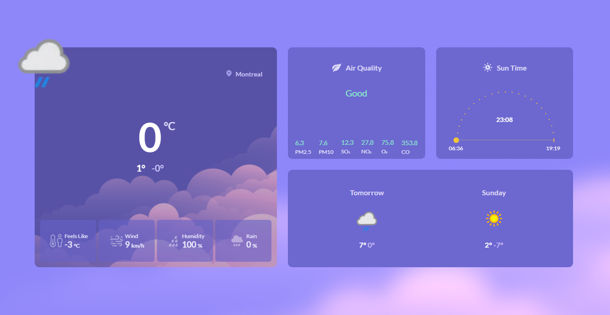
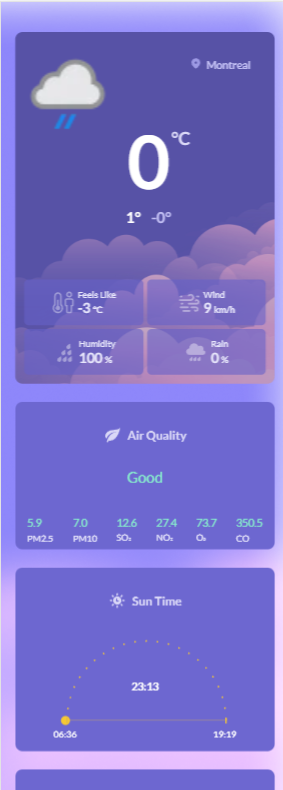

<h2 align='center'>
🚀 Technologies
</h2>

This project was developed with the following technologies:

HTML 
CSS 
JavaScript 
React 
Axios 
Git and Github 
Figma 

 
<h1 align='center'>
💻 Project
</h1>

<h2 align='center'>
  Desktop
</h2>

<h2 align='center'>
 
  Mobile
</h2>

<h2 align='center'>
   
   
  Weather App
</h2>
 
This project is a simple weather application that displays weather forecasts for the next two days. It uses the OpenWeatherMap and WeatherAPI APIs to get weather data and the Geolocation API to get the user's location.

<h2 align='center'>
 
  Figma Project
</h2>

[Layout](https://www.figma.com/file/BNf2zfWC5plcCSeAbfpq3U/%23boraCodar---Desafio-10-(Community)?node-id=328-2&t=n2pjm0Ur2I3GB8si-0) created by [Rocketseat](https://rocketseat.com.br/) for the #boracodar project. You can find the project at the following link:

 

<h1 align='center' ><a href='https://weatherhdf23.netlify.app/' target='_blank'>See project online  </a>
</h1>

<h2 align='center'>
   
  Features
</h2>
 
Displays current weather conditions and weather forecasts for the next two days.
Displays the location name based on the user's geolocation or a search query.
Updates the position of the sun chart based on the current time.

<h2 align='center'>
  Usage
</h2>
 
The app displays the current weather conditions and weather forecasts for the next two days for the user's location.
To search for a different location, click on the search icon and enter the city name in the search bar.
The sun chart on the top of the app shows the current position of the sun based on the time of the day.
